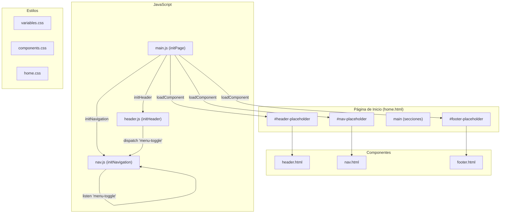
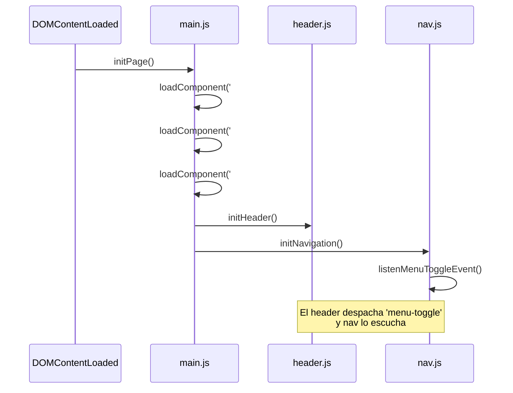
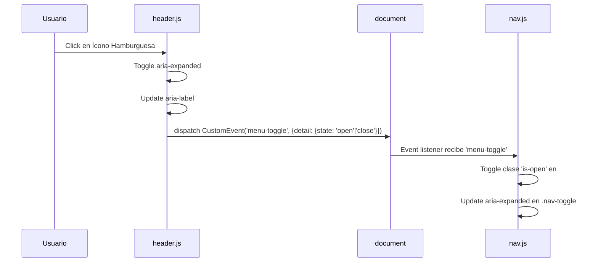

# Design Document: Header Dark Mode Home

## Overview

Este diseño describe la implementación de un componente Header independiente y la aplicación del modo oscuro como tema por defecto en la página de inicio del sitio web de NOUS CONCEPTS.

El proyecto actualmente utiliza un componente `nav.html` que combina la marca (logo), el botón hamburguesa y los enlaces de navegación en un solo archivo. Este diseño separa la responsabilidad: el Header se encarga del logo y del ícono hamburguesa, mientras que el `nav.html` existente gestiona los enlaces del menú. La comunicación entre ambos se realiza mediante `CustomEvent` sobre el `document`, un patrón de acoplamiento débil que permite que cada componente funcione de forma independiente.

El sitio ya utiliza una paleta oscura en `variables.css` (`--color-bg: #0f0f1a`, `--color-text: #eaeaea`), por lo que el modo oscuro es efectivamente el tema actual. El diseño formaliza esto y asegura que los criterios de contraste WCAG AAA se cumplan en toda la Página de Inicio.

### Decisiones clave de diseño

1. **Separación Header vs Nav**: El Header es un nuevo componente (`header.html` + `header.js`) totalmente independiente del `nav.html` existente. No comparten clases CSS ni funciones JS.
2. **Comunicación por eventos**: El Header despacha `CustomEvent('menu-toggle')` sobre `document`. El Nav escucha este evento para mostrar/ocultar el menú.
3. **Modo oscuro por defecto**: No se implementa toggle de tema. El modo oscuro se mantiene como única opción usando los design tokens existentes.
4. **Botón "Más"**: Un nuevo componente interactivo que realiza scroll suave hacia la siguiente sección, usando `element.scrollIntoView({ behavior: 'smooth' })`.

## Architecture



### Flujo de inicialización



### Flujo de interacción Header ↔ Nav



## Components and Interfaces

### 1. Header Component (`src/components/header.html`)

```html
<header class="site-header" role="banner">
  <nav aria-label="Encabezado principal">
    <a class="site-header__logo" href="home.html" aria-label="NOUS CONCEPTS - Inicio">
      NOUS CONCEPTS
    </a>
    <button
      class="site-header__menu-btn"
      type="button"
      aria-expanded="false"
      aria-controls="nav-menu"
      aria-label="Abrir menú"
    >
      <span class="site-header__menu-icon"></span>
    </button>
  </nav>
</header>
```

**Clases CSS del Header** (no colisionan con `.main-nav`, `.nav-toggle`, `.nav-links`, `#nav-menu`):
- `.site-header` — contenedor principal
- `.site-header__logo` — enlace del logo
- `.site-header__menu-btn` — botón hamburguesa
- `.site-header__menu-icon` — ícono visual (3 líneas)

### 2. Header JavaScript (`src/js/header.js`)

```javascript
// Exporta:
export { initHeader, toggleMenu, getMenuState };

// initHeader(): Registra event listener en el botón, inicializa estado
// toggleMenu(): Alterna aria-expanded, aria-label, despacha CustomEvent
// getMenuState(): Retorna 'open' | 'close' basado en aria-expanded
```

**Interfaz del CustomEvent:**
```javascript
document.dispatchEvent(new CustomEvent('menu-toggle', {
  detail: { state: 'open' | 'close' }
}));
```

### 3. Nav Component actualizado (`src/js/nav.js`)

Se añade un listener para el evento `menu-toggle`:

```javascript
// Nueva función exportada:
export { initNavigation, toggleMobileMenu, setActivePage, getPageNameFromPath, listenMenuToggleEvent };

// listenMenuToggleEvent(): Escucha 'menu-toggle' en document y alterna visibilidad del menú
```

### 4. Botón "Más" (`src/js/scroll-more.js`)

```javascript
// Exporta:
export { initScrollMoreButtons, scrollToNextSection };

// initScrollMoreButtons(): Busca todos los .scroll-more-btn y registra click handlers
// scrollToNextSection(button): Dado un botón, encuentra la siguiente sección y hace scroll suave
```

### 5. Main.js actualizado

```javascript
import { initHeader } from './header.js';
import { initNavigation } from './nav.js';
import { initScrollMoreButtons } from './scroll-more.js';

async function initPage() {
  await loadComponent('#header-placeholder', '../components/header.html');
  await loadComponent('#nav-placeholder', '../components/nav.html');
  await loadComponent('#footer-placeholder', '../components/footer.html');

  initHeader();
  initNavigation();
  initScrollMoreButtons();
}
```

## Data Models

### Estado del menú

El estado del menú se modela implícitamente en el DOM mediante atributos ARIA:

| Atributo | Elemento | Valores | Significado |
|----------|----------|---------|-------------|
| `aria-expanded` | `.site-header__menu-btn` | `"true"` / `"false"` | Menú abierto/cerrado |
| `aria-label` | `.site-header__menu-btn` | `"Abrir menú"` / `"Cerrar menú"` | Etiqueta accesible |
| `class` | `#nav-menu` | contiene `is-open` o no | Visibilidad CSS del menú |

### CustomEvent payload

```typescript
interface MenuToggleDetail {
  state: 'open' | 'close';
}
// Evento: new CustomEvent('menu-toggle', { detail: MenuToggleDetail })
```

### Design Tokens (Dark Mode)

Los tokens existentes en `variables.css` ya definen el modo oscuro:

| Token | Valor | Uso |
|-------|-------|-----|
| `--color-bg` | `#0f0f1a` | Fondo principal |
| `--color-primary` | `#1a1a2e` | Fondo del header/nav |
| `--color-secondary` | `#16213e` | Fondo del hero |
| `--color-surface` | `#1a1a2e` | Fondo de secciones alternas |
| `--color-text` | `#eaeaea` | Texto principal |
| `--color-text-muted` | `#a0a0a0` | Texto secundario |
| `--color-accent` | `#e94560` | Acentos y CTAs |

### Estructura del Botón "Más"

```html
<div class="scroll-more" aria-hidden="false">
  <button class="scroll-more__btn" type="button" aria-label="Ir a la sección Servicios">
    <span class="scroll-more__text">Más</span>
    <span class="scroll-more__icon" aria-hidden="true">▼</span>
  </button>
</div>
```

## Correctness Properties

*A property is a characteristic or behavior that should hold true across all valid executions of a system — essentially, a formal statement about what the system should do. Properties serve as the bridge between human-readable specifications and machine-verifiable correctness guarantees.*

### Property 1: Toggle state consistency

*For any* initial menu state (open or closed) and any number N of toggle invocations, the header button's `aria-expanded` attribute SHALL equal `"true"` if N is odd (menu open) and `"false"` if N is even (menu closed), and `aria-label` SHALL equal `"Cerrar menú"` when expanded is `"true"` and `"Abrir menú"` when expanded is `"false"`.

**Validates: Requirements 3.2, 3.3, 3.4**

### Property 2: Event dispatch correctness

*For any* initial menu state, when the hamburger button is activated, the header SHALL dispatch a `CustomEvent('menu-toggle')` on `document` whose `detail.state` equals `"open"` if the menu was previously closed, or `"close"` if the menu was previously open.

**Validates: Requirements 4.1**

### Property 3: Nav responds to menu-toggle events

*For any* `CustomEvent('menu-toggle')` dispatched with `detail.state` being `"open"` or `"close"`, the navigation component SHALL set the `is-open` class on `#nav-menu` to be present if state is `"open"` and absent if state is `"close"`, and set `aria-expanded` on `.nav-toggle` to `"true"` if state is `"open"` and `"false"` if state is `"close"`.

**Validates: Requirements 4.2, 4.4**

### Property 4: Dark mode luminosity constraints

*For any* background color variable used in the page (`--color-bg`, `--color-primary`, `--color-secondary`, `--color-surface`), its relative luminance SHALL be ≤ 0.05. For any text color variable (`--color-text`), its relative luminance SHALL be ≥ 0.85.

**Validates: Requirements 5.1, 5.3**

### Property 5: Contrast ratio compliance

*For any* pair of (text-color, background-color) used together in the page's design tokens, the WCAG contrast ratio SHALL be ≥ 4.5:1.

**Validates: Requirements 5.4**

### Property 6: Scroll-more targets next section

*For any* scroll-more button placed between two consecutive sections in the page, invoking `scrollToNextSection(button)` SHALL identify the immediately following sibling `<section>` element as the scroll target and invoke `scrollIntoView` on it.

**Validates: Requirements 6.4**

## Error Handling

### Header Component Errors

| Scenario | Behavior |
|----------|----------|
| `loadComponent` fails to fetch `header.html` | `console.error` logged, `#header-placeholder` remains empty, page continues loading without header |
| `initHeader()` called but hamburger button not in DOM | Function returns early without error, no event listeners registered |
| Nav component not present when `menu-toggle` dispatched | Event dispatches normally (no listener to catch it), no exception thrown (Req 4.3) |
| `scrollToNextSection()` finds no next section | Function returns without action, no scroll performed (Req 6.6) |

### Focus Management

| Scenario | Behavior |
|----------|----------|
| Menu closes while focus is inside nav | Focus moves to hamburger button (Req 3.6) |
| Menu closes while focus is outside nav | No focus change |
| Header or nav not loaded | Respective init functions return gracefully |

### Defensive Patterns

- All DOM queries use null checks before accessing properties
- `CustomEvent` dispatch is wrapped to handle environments where `CustomEvent` constructor may not be available (legacy fallback unlikely needed for modern target, but graceful)
- `scrollIntoView` availability checked before invocation

## Testing Strategy

### Unit Tests (Vitest + jsdom)

Unit tests verify specific examples and edge cases:

- **header.js**: `initHeader` registers click listener, `toggleMenu` updates DOM attributes correctly, `getMenuState` reads state
- **nav.js**: `listenMenuToggleEvent` responds to custom events, existing tests for `getPageNameFromPath`, `setActivePage`, `toggleMobileMenu`
- **scroll-more.js**: `initScrollMoreButtons` finds all buttons, `scrollToNextSection` identifies correct target, does nothing when no next section
- **CSS structure**: Verify header HTML doesn't contain nav-specific selectors (Req 1.2)
- **Accessibility**: Verify ARIA attributes, keyboard operability, focus management

### Property-Based Tests (fast-check + Vitest)

Property-based tests validate universal properties across randomized inputs:

- **Library**: `fast-check` (already in devDependencies)
- **Minimum iterations**: 100 per property test
- **Tag format**: `Feature: header-dark-mode-home, Property {N}: {title}`

Each correctness property maps to a single property-based test:

1. **Property 1** — Generate random sequences of toggle calls (length 1–50), verify final state matches parity
2. **Property 2** — Generate random initial states, trigger toggle, verify dispatched event detail
3. **Property 3** — Generate random `menu-toggle` events with `'open'`/`'close'` state, verify nav DOM response
4. **Property 4** — For all background/text color tokens, compute relative luminance and verify constraints
5. **Property 5** — For all (text, background) color pairs used together, compute contrast ratio ≥ 4.5:1
6. **Property 6** — Generate DOM structures with varying numbers of sections and buttons, verify correct target identification

### Integration Tests

- Full page load: verify `initPage` loads all components in correct order
- Header ↔ Nav communication: end-to-end toggle flow via CustomEvent
- Responsive behavior: verify hamburger visibility at different viewport widths (manual/visual testing)

### Test Organization

```
src/js/
├── header.js
├── header.test.js          # Unit + property tests for header
├── nav.js
├── nav.test.js             # Existing + new event listener tests
├── scroll-more.js
├── scroll-more.test.js     # Unit + property tests for scroll
├── main.js
└── main.test.js            # Integration tests for initPage
```

