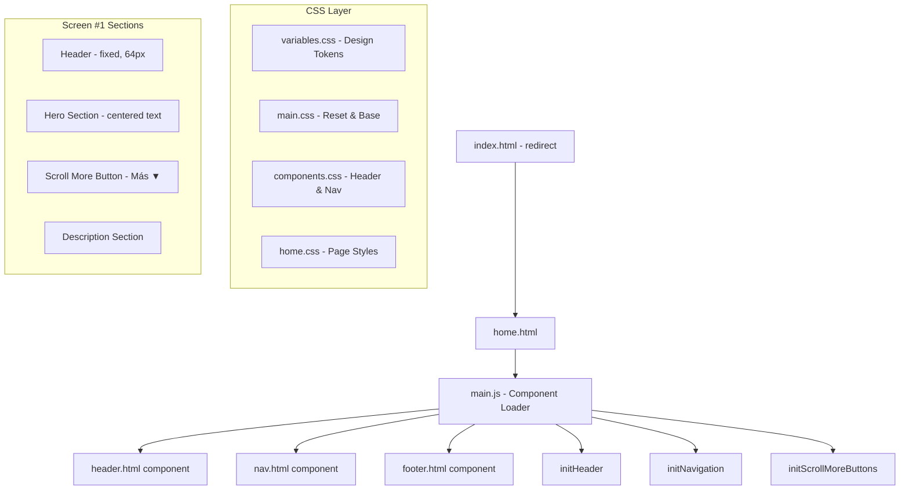

# Design Document: Home Dark Mode Screen

## Overview

This design covers the implementation of the home screen (screen #1) for the "Nous Concepts" website in dark mode with a mobile-first approach. The screen is composed of a fixed header (with logo and hamburger menu), a hero section with centered text, a "Más" scroll button with chevron, and a description section. The dark mode theme is the default, using the existing CSS design tokens defined in `variables.css`.

The project already has a functional home page (`src/pages/home.html`) with multiple sections. This feature focuses on ensuring the first visible screen (hero + scroll button + description) fully satisfies the dark mode, responsive, and accessibility requirements as the primary user-facing experience.

### Key Design Decisions

1. **Mobile-first CSS**: Base styles target viewports ≤ 768px. Desktop enhancements are applied via `@media (min-width: 769px)`.
2. **Existing architecture preserved**: The project uses vanilla HTML/CSS/JS with component loading via `fetch()`. No frameworks are introduced.
3. **CSS custom properties**: All colors, fonts, and spacing derive from `variables.css` tokens — no hardcoded values.
4. **Component separation**: Header logic (`header.js`) and navigation logic (`nav.js`) communicate via `CustomEvent`, maintaining loose coupling.
5. **Dark mode by default**: Applied unconditionally in CSS without `prefers-color-scheme` media queries.

---

## Architecture



### Page Load Flow

1. Browser loads `home.html` with CSS imports (variables → main → components → home)
2. `DOMContentLoaded` triggers `initPage()` in `main.js`
3. `loadComponent()` fetches and injects header, nav, and footer HTML fragments
4. `initHeader()` registers click handler on hamburger button
5. `initNavigation()` sets active page and listens for `menu-toggle` events
6. `initScrollMoreButtons()` attaches click handlers to all `.scroll-more__btn` elements

---

## Components and Interfaces

### 1. Header Component (`src/components/header.html` + `src/js/header.js`)

**Responsibilities:**
- Display "NOUS CONCEPTS" logo as a link to home
- Show hamburger menu button on mobile (≤ 768px)
- Show inline navigation links on desktop (> 768px)
- Toggle ARIA attributes on menu activation

**Interface:**
```javascript
// header.js exports
initHeader(): void          // Registers click listener on menu button
toggleMenu(): void          // Toggles aria-expanded, aria-label, dispatches 'menu-toggle' event
getMenuState(): 'open' | 'close' | null
```

**Events dispatched:**
- `CustomEvent('menu-toggle', { detail: { state: 'open' | 'close' } })` on `document`

### 2. Navigation Component (`src/components/nav.html` + `src/js/nav.js`)

**Responsibilities:**
- Display navigation links
- Open/close mobile menu panel in response to `menu-toggle` events
- Highlight active page link
- Manage focus when menu closes

**Interface:**
```javascript
// nav.js exports
initNavigation(): void
toggleMobileMenu(): void
setActivePage(pageName: string): void
getPageNameFromPath(path: string): string
listenMenuToggleEvent(): void
```

### 3. Scroll More Button (`src/js/scroll-more.js`)

**Responsibilities:**
- On click, scroll smoothly to the next `<section>` sibling after the `.scroll-more` container
- Do nothing if no subsequent section exists

**Interface:**
```javascript
// scroll-more.js exports
initScrollMoreButtons(): void
scrollToNextSection(button: HTMLElement): void
```

**Algorithm for `scrollToNextSection`:**
1. Find the `.scroll-more` container (parent of the button)
2. Traverse `nextElementSibling` until a `<section>` is found
3. Call `element.scrollIntoView({ behavior: 'smooth' })` on the found section
4. If no section found, return without action

### 4. CSS Architecture

| File | Responsibility |
|------|---------------|
| `variables.css` | Design tokens (colors, fonts, spacing, breakpoints) |
| `main.css` | Reset, base body styles, utility classes |
| `components.css` | Header, navigation, footer styles |
| `home.css` | Hero, description, scroll-more, and responsive overrides |

---

## Data Models

This feature is a static front-end page with no persistent data models. The relevant "data" is the DOM structure and CSS custom property values.

### CSS Design Tokens (from `variables.css`)

| Token | Value | Usage |
|-------|-------|-------|
| `--color-primary` | `#1a1a2e` | Header background |
| `--color-secondary` | `#16213e` | Hero section background |
| `--color-accent` | `#e94560` | Interactive element default color |
| `--color-text` | `#eaeaea` | Primary text (headings, buttons) |
| `--color-text-muted` | `#a0a0a0` | Secondary text (taglines, descriptions) |
| `--color-bg` | `#0f0f1a` | Page background, description section |
| `--color-surface` | `#1a1a2e` | Grouped visual sections |
| `--font-heading` | `'CustomHeading', sans-serif` | Headings, logo |
| `--font-body` | `'CustomBody', sans-serif` | Body text |
| `--font-size-base` | `1rem` | Mobile body text |
| `--font-size-lg` | `1.25rem` | Desktop description text |
| `--font-size-xl` | `2rem` | Mobile hero title, desktop subtitle |
| `--font-size-hero` | `3.5rem` | Desktop hero title |
| `--nav-height` | `64px` | Fixed header height |
| `--spacing-xs` | `0.5rem` | Button padding |
| `--spacing-sm` | `1rem` | Horizontal padding, gaps |
| `--spacing-md` | `2rem` | Scroll-more padding |
| `--spacing-lg` | `4rem` | Section vertical padding |

### DOM Structure (Screen #1)

```html
<body>
  <!-- Header (position: fixed, 64px height) -->
  <header class="site-header">...</header>

  <!-- Navigation (loaded into placeholder) -->
  <nav class="main-nav">...</nav>

  <main>
    <!-- Hero Section -->
    <section class="hero" aria-label="...">
      <div class="hero__content">
        <h1 class="hero__title">NOUS CONCEPTS</h1>
        <p class="hero__tagline">...</p>
      </div>
    </section>

    <!-- Scroll More Button -->
    <div class="scroll-more">
      <button class="scroll-more__btn" aria-label="...">
        <span class="scroll-more__text">Más</span>
        <span class="scroll-more__icon" aria-hidden="true">▼</span>
      </button>
    </div>

    <!-- Description Section -->
    <section class="description" aria-label="...">
      <p class="description__text">...</p>
    </section>
  </main>
</body>
```

### Menu State Model

```
State: { expanded: boolean }
Transitions:
  toggle() → expanded = !expanded
  aria-expanded = String(expanded)
  aria-label = expanded ? "Cerrar menú" : "Abrir menú"
  dispatches: CustomEvent('menu-toggle', { detail: { state: expanded ? 'open' : 'close' } })
```

---

## Correctness Properties

*A property is a characteristic or behavior that should hold true across all valid executions of a system — essentially, a formal statement about what the system should do. Properties serve as the bridge between human-readable specifications and machine-verifiable correctness guarantees.*

### Property 1: Scroll targets the next section sibling

*For any* DOM structure where a `.scroll-more` container has one or more `<section>` elements as subsequent siblings (possibly with non-section elements in between), calling `scrollToNextSection(button)` SHALL invoke `scrollIntoView` on the first `<section>` sibling immediately following the container.

**Validates: Requirements 5.3**

### Property 2: Scroll does nothing when no section follows

*For any* DOM structure where a `.scroll-more` container has no subsequent `<section>` sibling, calling `scrollToNextSection(button)` SHALL not invoke `scrollIntoView` on any element and SHALL not throw an error.

**Validates: Requirements 5.9**

### Property 3: Menu toggle is an involution (round-trip)

*For any* sequence of N toggle activations on the hamburger menu button, the `aria-expanded` attribute SHALL alternate between `"false"` and `"true"` on each activation, and after an even number of toggles the state SHALL equal the initial state.

**Validates: Requirements 3.6, 3.7, 8.4, 8.5**

### Property 4: No horizontal overflow at any viewport width

*For any* viewport width W where 320 ≤ W ≤ 1920 pixels, no element within the Pantalla_Home SHALL have a rendered width exceeding W pixels, ensuring no horizontal scrollbar appears.

**Validates: Requirements 1.2**

---

## Error Handling

This feature is a static front-end page with minimal runtime error scenarios:

| Scenario | Handling Strategy |
|----------|-----------------|
| Header component fails to load (`fetch` error) | `loadComponent()` catches the error and logs to console. Page remains functional without the header. |
| No next `<section>` after scroll-more button | `scrollToNextSection()` silently returns without action (Req 5.9). |
| Hamburger button not found in DOM | `initHeader()` returns early with no side effects. `toggleMenu()` returns early. |
| JS disabled in browser | HTML structure remains visible. Scroll button won't function but page content is accessible via native scroll. No layout breaks. |
| CSS custom properties unsupported (very old browsers) | Fallback not provided — the project targets modern browsers. Colors will be unset (browser defaults). |

### Graceful Degradation

- The page is built with progressive enhancement: content is readable without JS.
- CSS animations/transitions use `ease` timing with short durations (0.2–0.3s) to avoid janky fallbacks.
- The `scroll-behavior: smooth` on `<html>` provides native smooth scroll support independent of JS.

---

## Testing Strategy

### Testing Framework

- **Test runner**: Vitest (already configured in `vitest.config.js`)
- **DOM environment**: JSDOM (configured as default environment)
- **Property-based testing**: fast-check (already in `devDependencies`)

### Unit Tests (Example-Based)

Unit tests verify specific, concrete behaviors:

| Test Area | What to Verify |
|-----------|---------------|
| DOM Structure | Sections appear in correct order: hero → scroll-more → description |
| Dark Mode | Body and sections use correct CSS variable references (no `prefers-color-scheme`) |
| Header | Logo text is "NOUS CONCEPTS", links to home, height is 64px |
| Header Toggle | Click toggles aria-expanded and aria-label correctly |
| Hero Section | Title content, tagline content, aria-label present |
| Scroll Button | Contains "Más" text and "▼" icon in separate block elements |
| Scroll Button | Has aria-label attribute |
| Description | Has max-width 720px, centered, aria-label present |
| Accessibility | All interactive elements have keyboard focus indicators |
| Responsive | Mobile base styles at ≤ 768px, desktop styles via media query |
| Contrast | Verify 4.5:1 ratio for text/bg color pairs |

### Property-Based Tests

Property tests validate universal invariants using `fast-check`:

| Property | Generator | Assertion |
|----------|-----------|-----------|
| P1: Scroll targets next section | Random DOM with 0–5 non-section elements between container and next section | `scrollIntoView` called on correct section |
| P2: Scroll no-op without section | Random DOM with no section after container | No `scrollIntoView` called, no error |
| P3: Toggle involution | Random number N (1–50) of toggle calls | After N toggles, aria-expanded = (N % 2 !== 0) |
| P4: No horizontal overflow | Random viewport width 320–1920 | No element width > viewport width |

**Configuration:**
- Minimum 100 iterations per property test
- Each test tagged with: `Feature: home-dark-mode-screen, Property {N}: {description}`

**Note on Property 4:** JSDOM does not compute layout. This property is best verified via visual regression tests or a browser-based testing tool (e.g., Playwright). In the JSDOM environment, we can partially verify by checking that no element has explicit width values exceeding `100%` or fixed pixel widths larger than 320px without responsive overrides.

### Test File Organization

```
src/js/scroll-more.test.js   — Unit + property tests for scroll behavior (P1, P2)
src/js/header.test.js        — Unit + property tests for menu toggle (P3)
src/js/home-layout.test.js   — Unit tests for DOM structure, dark mode, accessibility
```

### Integration Testing (Manual)

- Visual verification of responsive breakpoints (320px, 768px, 1024px, 1920px)
- Keyboard navigation flow verification
- Screen reader testing with NVDA/VoiceOver
- Contrast ratio verification with browser DevTools
