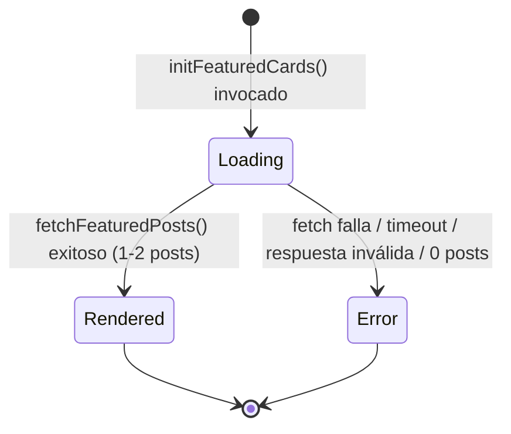

# Design Document: Home Featured Blog Cards

## Overview

Esta funcionalidad añade la sección "Estrenos Destacados" a la página de inicio (home.html) de NOUS CONCEPTS. La sección obtiene dinámicamente las dos publicaciones más recientes desde la API del blog corporativo y las presenta como tarjetas visualmente coherentes con el sistema de diseño oscuro existente. El módulo sigue los patrones del proyecto: JavaScript vanilla con ES modules, fetch para carga de datos, CSS BEM mobile-first, y tokens de diseño (variables CSS) centralizados.

### Decisiones de diseño clave

1. **Separación datos/presentación**: Un módulo `blog-service.js` encapsula la lógica de fetch, validación y transformación de datos. Un módulo `featured-cards.js` se encarga del renderizado DOM. Esto permite probar la lógica de datos independientemente del DOM.
2. **Renderización dinámica sobre contenido estático**: Las tarjetas se renderizan desde JavaScript — el HTML solo contiene el esqueleto de la sección (etiqueta, título, contenedor de tarjetas, botón).
3. **Degradación elegante**: Si la API falla o no devuelve datos válidos, se muestra un estado de error que no interrumpe la navegación del sitio.
4. **Mobile-first**: Los estilos base apilan tarjetas en columna; un media query a >768px las presenta en dos columnas.
5. **Fidelidad al mockup móvil**: El layout, la tipografía serif de los encabezados, la línea de metadatos con separador de viñeta y el botón CTA tipo píldora se derivan de la referencia visual móvil (ver "Especificación visual").

### Especificación visual (mockup móvil)

La Seccion_Destacados se renderiza sobre el mismo fondo del sitio usando el token `--color-bg` (en el mockup el tema base se percibe como un tono crema/marfil claro), con el acento navy/índigo profundo aplicado vía `--color-accent` para la etiqueta, los títulos y el botón. Toda referencia de color y tipografía usa exclusivamente los tokens existentes en `variables.css` — este documento no redefine tokens.

Estructura visual de arriba hacia abajo (móvil, una columna):

1. **Cabecera del sitio** (ya existente, fuera de esta feature): wordmark "NOUS ·" arriba a la izquierda y botón hamburguesa circular arriba a la derecha. La Seccion_Destacados se ubica debajo, sobre el mismo fondo (`--color-bg`).
2. **Etiqueta de sección** ("ESTRENOS DESTACADOS"): mayúsculas, tamaño pequeño, peso bold, color `--color-accent`, con `letter-spacing` notable. Situada directamente encima del título.
3. **Título de sección** ("Cultura, relatos e historias que laten"): encabezado display serif (`--font-heading`), color acento navy/índigo, tamaño grande, con `line-height` generoso; puede fluir a 2–3 líneas. Se ubica bajo la etiqueta con espaciado ajustado (tight).
4. **Tarjetas apiladas verticalmente** (móvil, una columna, con espaciado vertical generoso). Cada tarjeta es una superficie de esquinas redondeadas (`--color-surface`) con apariencia suave/sutil, compuesta por:
   - **Imagen superior**: ocupa todo el ancho de la tarjeta, con esquinas superiores redondeadas (radio consistente con la tarjeta), `aspect-ratio` fijo y `object-fit: cover`.
   - **Área de contenido** (con padding interior) que contiene, en orden:
     - **Línea de metadatos** (`.featured-card__meta`): categoría + tiempo de lectura en la **misma línea**, separados por una viñeta "•" — p. ej. `CINE • 5 min de lectura`. La categoría es mayúsculas, pequeña y bold; el tiempo de lectura va en la misma línea con peso más ligero. **Cuando el tiempo de lectura está ausente** (p. ej. la segunda tarjeta solo muestra `SERIE`), se omiten por completo tanto la viñeta separadora como el tiempo de lectura.
     - **Título de la tarjeta**: encabezado serif (`--font-heading`), tamaño medio-grande, color navy/índigo; puede fluir a 2 líneas.
     - **Descripción/extracto opcional**: texto de cuerpo atenuado (`--color-text-muted`), ~3 líneas; se muestra solo cuando está presente (la primera tarjeta la incluye; la segunda la omite).
5. **Botón CTA** ("Más Contenido →"): botón con forma de **píldora** centrado horizontalmente, relleno navy/índigo oscuro (`--color-accent`), texto claro, `border-radius` de píldora, padding horizontal amplio y una flecha "→" tras la etiqueta. Con margen superior respecto a las tarjetas.
6. **General**: mobile-first, márgenes/padding horizontales generosos de página, fondo del tema (`--color-bg`), navy/índigo como acento primario para etiqueta/título/botón, serif para encabezados. El layout de dos columnas se activa por encima de 768px (Requirement 8.2).

## Architecture

```mermaid
graph TD
    A[home.html] -->|contiene| B[Seccion_Destacados - HTML esqueleto]
    A -->|carga script| C[main.js]
    C -->|importa e invoca| D[featured-cards.js]
    D -->|solicita datos| E[blog-service.js]
    E -->|HTTP GET| F[API_Blog]
    F -->|JSON response| E
    E -->|Entrada_Blog[] transformadas| D
    D -->|renderiza DOM| B
    G[featured-cards.css] -->|estilos BEM| B
```

### Flujo de ejecución

1. `DOMContentLoaded` → `initPage()` en `main.js`
2. `initPage()` llama a `initFeaturedCards()` (nuevo export de `featured-cards.js`)
3. `initFeaturedCards()`:
   - Muestra estado de carga (skeleton placeholders)
   - Invoca `fetchFeaturedPosts()` de `blog-service.js`
   - En éxito: renderiza hasta 2 tarjetas
   - En error: muestra mensaje de error, loguea en consola

### Integración con la home page

La sección se posiciona en `home.html` entre la sección "Contents Preview" y el scroll-more button previo a "About", siguiendo la estructura existente de secciones con scroll-more buttons intermedios.

## Components and Interfaces

### 1. blog-service.js (módulo de datos)

```javascript
/**
 * @typedef {Object} BlogPost
 * @property {string} title - Título de la entrada
 * @property {string} imageUrl - URL de la imagen destacada
 * @property {string} imageAlt - Texto alternativo (derivado del título)
 * @property {string} category - Categoría (ej: "CINE", "SERIE")
 * @property {number|null} readingTime - Minutos de lectura (null si ausente)
 * @property {string|null} description - Extracto/descripción (null si ausente)
 * @property {string} url - URL al artículo completo
 */

/**
 * Solicita las entradas destacadas del blog corporativo.
 * @param {string} apiUrl - URL de la API del blog
 * @param {Object} [options] - Opciones de configuración
 * @param {number} [options.maxPosts=2] - Número máximo de posts a devolver
 * @param {number} [options.timeout=8000] - Timeout en ms
 * @returns {Promise<BlogPost[]>} Array de 0-2 posts transformados
 * @throws {Error} Si la petición falla, timeout, o respuesta inválida
 */
export async function fetchFeaturedPosts(apiUrl, options = {}) {}

/**
 * Transforma un objeto crudo de la API al formato BlogPost.
 * @param {Object} rawPost - Objeto de la API
 * @returns {BlogPost} Post normalizado
 */
export function mapApiPostToBlogPost(rawPost) {}

/**
 * Valida que un array de datos crudos contiene al menos una entrada válida.
 * @param {unknown} data - Respuesta parseada del JSON
 * @returns {boolean}
 */
export function isValidBlogResponse(data) {}
```

### 2. featured-cards.js (módulo de renderizado)

```javascript
/**
 * Inicializa la sección de tarjetas destacadas.
 * Muestra carga, obtiene datos, renderiza tarjetas o estado de error.
 * @param {Object} [config] - Configuración opcional
 * @param {string} [config.apiUrl] - URL de la API (para testing/override)
 * @param {string} [config.containerSelector] - Selector del contenedor de tarjetas
 * @returns {Promise<void>}
 */
export async function initFeaturedCards(config = {}) {}

/**
 * Genera el HTML de una tarjeta a partir de un BlogPost.
 * @param {import('./blog-service.js').BlogPost} post
 * @returns {string} HTML string de la tarjeta
 */
export function renderCard(post) {}

/**
 * Genera el HTML del estado de carga (skeleton).
 * @param {number} count - Número de skeletons a generar
 * @returns {string} HTML string
 */
export function renderLoadingState(count = 2) {}

/**
 * Genera el HTML del estado de error.
 * @returns {string} HTML string
 */
export function renderErrorState() {}
```

### 3. HTML (sección estática en home.html)

```html
<!-- Scroll More Button (Contents → Featured) -->
<div class="scroll-more" aria-hidden="false">
  <button class="scroll-more__btn" type="button" aria-label="Ir a la sección Estrenos Destacados">
    <span class="scroll-more__text">Más</span>
    <span class="scroll-more__icon" aria-hidden="true">▼</span>
  </button>
</div>

<!-- Featured Blog Cards Section -->
<section class="featured" aria-label="Estrenos destacados del blog">
  <span class="featured__label">ESTRENOS DESTACADOS</span>
  <h2 class="featured__title">Cultura, relatos e historias que laten</h2>
  <div class="featured__cards" aria-live="polite">
    <!-- Tarjetas renderizadas dinámicamente por featured-cards.js -->
  </div>
  <!-- CTA tipo píldora, centrado, con flecha -->
  <a class="featured__cta" href="contenidos.html">
    <span class="featured__cta-label">Más Contenido</span>
    <span class="featured__cta-arrow" aria-hidden="true">→</span>
  </a>
</section>

<!-- Scroll More Button (Featured → About) -->
<div class="scroll-more" aria-hidden="false">
  <button class="scroll-more__btn" type="button" aria-label="Ir a la sección Sobre Nosotros">
    <span class="scroll-more__text">Más</span>
    <span class="scroll-more__icon" aria-hidden="true">▼</span>
  </button>
</div>
```

### 4. Markup renderizado de una Tarjeta_Destacada

`renderCard(post)` produce esta estructura (imagen arriba + área de contenido con padding). La línea de metadatos coloca categoría y tiempo de lectura en la misma línea separados por una viñeta "•":

```html
<article class="featured-card">
  <a class="featured-card__link" href="{{url}}" aria-label="{{title}}">
    
    <div class="featured-card__content">
      <!-- Línea de metadatos: "CINE • 5 min de lectura" -->
      <p class="featured-card__meta">
        <span class="featured-card__category">{{category}}</span>
        <!-- viñeta + tiempo de lectura SOLO si readingTime !== null -->
        <span class="featured-card__separator" aria-hidden="true">•</span>
        <span class="featured-card__reading-time">{{readingTime}} min de lectura</span>
      </p>
      <h3 class="featured-card__heading">{{title}}</h3>
      <!-- descripción SOLO si description !== null -->
      <p class="featured-card__description">{{description}}</p>
    </div>
  </a>
</article>
```

Reglas de omisión condicional (Req 3.7):
- Si `readingTime === null` → se omiten tanto `.featured-card__separator` como `.featured-card__reading-time` (la línea de metadatos muestra solo la categoría, p. ej. `SERIE`).
- Si `description === null` → se omite el elemento `.featured-card__description`.

### 5. CSS (featured-cards.css — BEM)

Bloques principales:
- `.featured` — contenedor de sección (márgenes/padding horizontales generosos, `text-align: center` para etiqueta/título/CTA)
- `.featured__label` — etiqueta superior (mayúsculas, bold, `--color-accent`, `letter-spacing` notable)
- `.featured__title` — encabezado h2 display serif (`--font-heading`, `--color-accent`, `line-height` generoso, admite 2–3 líneas)
- `.featured__cards` — flex/grid de tarjetas (columna en móvil con `gap` generoso; dos columnas > 768px)
- `.featured__cta` — botón "Más Contenido" tipo **píldora** (relleno `--color-accent`, texto claro, `border-radius` de píldora, padding horizontal amplio, `display: inline-flex` centrado con `margin-inline: auto`)
  - `.featured__cta-label` — texto del botón
  - `.featured__cta-arrow` — flecha "→" tras la etiqueta (`aria-hidden`)
- `.featured-card` — bloque de tarjeta individual (superficie `--color-surface`, esquinas redondeadas, `overflow: hidden`, apariencia suave, `text-align: left`)
- `.featured-card__link` — enlace envolvente al artículo (área navegable de toda la tarjeta)
- `.featured-card__image` — imagen superior a ancho completo, esquinas superiores redondeadas, `aspect-ratio` fijo, `object-fit: cover`
- `.featured-card__content` — área de contenido con padding interior
- `.featured-card__meta` — línea de metadatos (categoría + tiempo de lectura en la misma línea, `display: flex`/inline con `gap` pequeño)
- `.featured-card__category` — etiqueta de categoría (mayúsculas, pequeña, bold, `--color-accent`)
- `.featured-card__separator` — viñeta "•" separadora (visible solo cuando hay tiempo de lectura)
- `.featured-card__reading-time` — tiempo de lectura (misma línea, peso más ligero, `--color-text-muted`)
- `.featured-card__heading` — título de la tarjeta (serif, medio-grande, `--color-accent`/`--color-text`, admite 2 líneas)
- `.featured-card__description` — extracto (`--color-text-muted`, ~3 líneas)
- `.featured__loading` — estado skeleton
- `.featured__error` — estado de error

## Data Models

### BlogPost (modelo interno)

| Campo | Tipo | Obligatorio | Descripción |
|-------|------|-------------|-------------|
| `title` | `string` | Sí | Título de la entrada |
| `imageUrl` | `string` | Sí | URL de imagen destacada |
| `imageAlt` | `string` | Sí | Texto alt (= título) |
| `category` | `string` | Sí | Categoría (ej: "CINE") |
| `readingTime` | `number \| null` | No | Minutos de lectura |
| `description` | `string \| null` | No | Texto de extracto |
| `url` | `string` | Sí | URL del artículo completo |

### Respuesta esperada de la API_Blog

El `blog-service.js` espera que la API devuelva un JSON con un array de objetos. Los nombres exactos de campos se configuran mediante un objeto de mapeo para adaptarse a la API real:

```javascript
// Ejemplo de configuración de mapeo por defecto
const DEFAULT_FIELD_MAP = {
  title: 'title',
  imageUrl: 'featured_image',
  category: 'category',
  readingTime: 'reading_time',
  description: 'excerpt',
  url: 'permalink'
};
```

### Estados de la UI



| Estado | Contenido visible |
|--------|-------------------|
| **Loading** | 2 skeleton placeholders animados, aria-live="polite" |
| **Rendered** | 1-2 tarjetas con datos del blog |
| **Error** | Mensaje informativo ("No se pudieron cargar los estrenos") |


## Correctness Properties

*A property is a characteristic or behavior that should hold true across all valid executions of a system — essentially, a formal statement about what the system should do. Properties serve as the bridge between human-readable specifications and machine-verifiable correctness guarantees.*

### Property 1: Selection limits to first 2 posts in order

*For any* array of N valid blog post objects (N ≥ 0), `fetchFeaturedPosts` SHALL return an array of length `min(N, 2)` containing the first `min(N, 2)` elements in their original order.

**Validates: Requirements 1.3, 2.2, 2.5**

### Property 2: API-to-BlogPost mapping preserves all fields

*For any* valid raw API response object containing title, image, category, reading time, description, and URL fields, `mapApiPostToBlogPost` SHALL produce a BlogPost where each field corresponds to the mapped source field value without loss or mutation.

**Validates: Requirements 2.3**

### Property 3: Rendered card contains all present BlogPost fields

*For any* valid BlogPost object, `renderCard` SHALL produce an HTML string that contains: the imageUrl as an img src, the title as the img alt attribute, the category text, the title as heading text, the url as an anchor href, and (when non-null) the readingTime formatted as "{n} min de lectura" and the description text.

**Validates: Requirements 2.4, 3.1, 3.2, 3.3, 3.4, 3.5, 3.6**

### Property 4: Optional fields absent when null produce no empty elements

*For any* BlogPost where `readingTime` is null, `renderCard` SHALL produce HTML that does not contain a reading-time element. Likewise, *for any* BlogPost where `description` is null, `renderCard` SHALL produce HTML that does not contain a description element.

**Validates: Requirements 3.7**

### Property 5: Validation rejects invalid blog responses

*For any* value that is not an array, or is an array containing zero objects with the required fields, `isValidBlogResponse` SHALL return false.

**Validates: Requirements 5.3**

### Property 6: Card link accessible name includes post title

*For any* valid BlogPost object, `renderCard` SHALL produce HTML where the card's navigable link element has an accessible name (via text content or aria-label) that includes the BlogPost title.

**Validates: Requirements 9.2, 9.5**

## Error Handling

### Errores de red y timeout

| Escenario | Comportamiento |
|-----------|---------------|
| `fetch` rechazado (sin red, DNS fail) | `fetchFeaturedPosts` lanza Error; `initFeaturedCards` captura, muestra Estado_Error, loguea en console.error |
| Timeout excedido (configurable, default 8s) | Se usa `AbortController` + `setTimeout`; misma cadena de error |
| HTTP status ≥ 400 | Se lanza Error con status/statusText; misma cadena |
| Respuesta no-JSON (parse error) | `response.json()` lanza; se captura y trata como error |
| JSON válido pero sin posts válidos | `isValidBlogResponse` retorna false → Error lanzado |

### Garantías durante error

- La Etiqueta_Seccion, Titulo_Seccion y Boton_Mas_Contenido permanecen visibles (están en HTML estático fuera del contenedor dinámico).
- El error se registra con `console.error` incluyendo la URL solicitada.
- No se propaga ninguna excepción al scope global — todo se captura dentro de `initFeaturedCards`.

### Estructura del estado de error (HTML)

```html
<div class="featured__error" role="status">
  <p class="featured__error-message">No se pudieron cargar los estrenos destacados.</p>
</div>
```

## Testing Strategy

### Enfoque dual: Unit tests + Property-based tests

**Property-based tests (fast-check + vitest)**:
- Librería: `fast-check` (ya instalada en devDependencies)
- Mínimo 100 iteraciones por propiedad
- Cada test referencia su propiedad del diseño con tag:
  - `Feature: home-featured-blog-cards, Property {N}: {descripción}`
- Las propiedades 1-6 se implementan como tests de fast-check sobre funciones puras (`fetchFeaturedPosts` con mock, `mapApiPostToBlogPost`, `renderCard`, `isValidBlogResponse`)

**Unit tests (vitest + jsdom)**:
- Verificación de estructura estática (Req 1.1, 1.2, 1.4, 1.5)
- Estado de carga y transiciones (Req 4.1, 4.2, 4.3)
- Manejo de errores por escenario (Req 5.1, 5.2, 5.4, 5.5)
- Botón "Más Contenido" (Req 6.1, 6.2)
- Navegación y accesibilidad DOM (Req 9.1, 9.4)

**Smoke / Visual tests** (manual o con Playwright si se agrega):
- Contraste WCAG (Req 7.5)
- Responsive layout mobile/desktop (Req 8.1–8.4)
- Focus indicators (Req 6.3, 6.4, 9.3)
- Touch target size (Req 6.3)

### Archivos de test

| Archivo | Cobertura |
|---------|-----------|
| `src/js/blog-service.test.js` | Properties 1, 2, 5 + unit tests de error handling |
| `src/js/featured-cards.test.js` | Properties 3, 4, 6 + unit tests de estados de carga/error y estructura |

### Generadores de datos (fast-check arbitraries)

```javascript
// Generador de un objeto BlogPost válido
const blogPostArb = fc.record({
  title: fc.string({ minLength: 1, maxLength: 200 }),
  imageUrl: fc.webUrl(),
  imageAlt: fc.string({ minLength: 1 }),
  category: fc.stringOf(fc.constantFrom('CINE', 'SERIE', 'CÓMIC', 'ANIMACIÓN', 'DOCUMENTAL')),
  readingTime: fc.option(fc.integer({ min: 1, max: 60 }), { nil: null }),
  description: fc.option(fc.string({ minLength: 1, maxLength: 500 }), { nil: null }),
  url: fc.webUrl()
});

// Generador de un array de posts de longitud variable
const blogPostArrayArb = fc.array(blogPostArb, { minLength: 0, maxLength: 10 });
```
