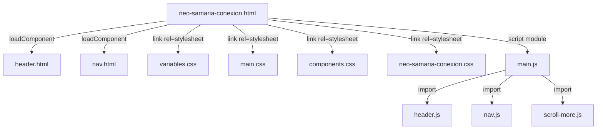
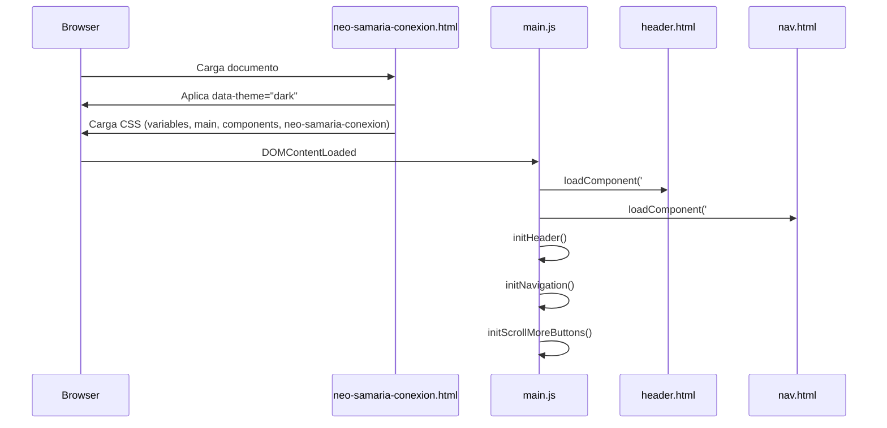

# Design Document: Neo Samaria Conexión

## Overview

La pantalla "Neo Samaria Conexión" es una página de contenido estático del sitio web Nous Concepts que presenta un proyecto original de ciencia ficción ambientado en el Caribe colombiano. La página sigue el patrón arquitectónico mobile-first ya establecido en el sitio: una estructura HTML semántica con carga dinámica de componentes reutilizables (Header y Nav), estilos CSS modulares con tokens de diseño centralizados, y modo oscuro como tema predeterminado.

La implementación replica fielmente los patrones existentes en `presentacion.html` y su CSS asociado, adaptando la estructura para incluir un título centrado, una sección de sinopsis textual y una sección con dos imágenes promocionales del proyecto.

### Decisiones de Diseño Clave

1. **Reuso de componentes existentes**: Header y Nav se cargan dinámicamente con `loadComponent()`, sin modificar los componentes fuente.
2. **CSS modular dedicado**: Un archivo `neo-samaria-conexion.css` con estilos específicos de la página, siguiendo la convención BEM del proyecto.
3. **Sin JavaScript nuevo**: La página no requiere lógica JS adicional; reutiliza `main.js` para la inicialización.
4. **Reserva de espacio para imágenes**: Se usa `aspect-ratio` en contenedores de imagen para evitar layout shift (CLS).

## Architecture

### Diagrama de Componentes



### Estructura de Archivos

```
src/
├── pages/
│   └── neo-samaria-conexion.html      ← Página nueva
├── styles/
│   └── neo-samaria-conexion.css       ← Estilos específicos de la página
├── assets/
│   └── images/
│       └── contenidos/
│           └── neo-samaria/
│               ├── hero.webp          ← Imagen hero del proyecto
│               └── secondary.webp     ← Imagen secundaria
├── components/
│   ├── header.html                    ← Reutilizado sin cambios
│   └── nav.html                       ← Reutilizado sin cambios
└── js/
    └── main.js                        ← Reutilizado sin cambios
```

### Flujo de Inicialización



## Components and Interfaces

### 1. neo-samaria-conexion.html

Página HTML principal que define la estructura semántica del contenido.

**Estructura DOM:**

```html
<!DOCTYPE html>
<html lang="es" data-theme="dark">
<head>
  <meta charset="UTF-8" />
  <meta name="viewport" content="width=device-width, initial-scale=1.0" />
  <title>Neo Samaria Conexión — NOUS CONCEPTS</title>
  <link rel="stylesheet" href="../styles/variables.css" />
  <link rel="stylesheet" href="../styles/main.css" />
  <link rel="stylesheet" href="../styles/components.css" />
  <link rel="stylesheet" href="../styles/neo-samaria-conexion.css" />
</head>
<body>
  <div id="header-placeholder"></div>
  <div id="nav-placeholder"></div>

  <main class="neo-samaria" aria-label="Proyecto Neo Samaria Conexión">
    <h1 class="neo-samaria__title">Neo Samaria Conexión</h1>

    <section class="neo-samaria__synopsis" aria-label="Sinopsis del proyecto Neo Samaria Conexión">
      <p>...</p>
    </section>

    <section class="neo-samaria__images" aria-label="Imágenes del proyecto Neo Samaria Conexión">
      <div class="neo-samaria__image-wrapper neo-samaria__image-wrapper--hero">
        
      </div>
      <div class="neo-samaria__image-wrapper neo-samaria__image-wrapper--secondary">
        
      </div>
    </section>
  </main>

  <script type="module" src="../js/main.js"></script>
</body>
</html>
```

**Interfaz con componentes existentes:**

| Componente | Selector placeholder | Ruta del fragmento | Inicializador |
|---|---|---|---|
| Header | `#header-placeholder` | `../components/header.html` | `initHeader()` |
| Nav | `#nav-placeholder` | `../components/nav.html` | `initNavigation()` |

### 2. neo-samaria-conexion.css

Hoja de estilos específica de la página, siguiendo la convención BEM con prefijo `neo-samaria`.

**Clases CSS:**

| Clase | Elemento | Responsabilidad |
|---|---|---|
| `.neo-samaria` | `<main>` | Contenedor principal, padding-top para header fijo, padding-inline |
| `.neo-samaria__title` | `<h1>` | Título centrado con tipografía responsive |
| `.neo-samaria__synopsis` | `<section>` | Contenedor de texto con max-width y line-height |
| `.neo-samaria__synopsis p` | `<p>` | Párrafos de sinopsis con margin-bottom |
| `.neo-samaria__images` | `<section>` | Contenedor flex-column para las imágenes |
| `.neo-samaria__image-wrapper` | `<div>` | Contenedor con aspect-ratio para reservar espacio |
| `.neo-samaria__image-wrapper img` | `` | Imagen con border-radius y dimensiones responsivas |

### 3. Imágenes del Proyecto

Las imágenes se almacenan en `src/assets/images/contenidos/neo-samaria/`:

| Imagen | Archivo | Formato recomendado | Aspect-ratio contenedor |
|---|---|---|---|
| Hero | `hero.webp` | WebP con fallback JPG | 16/9 |
| Secundaria | `secondary.webp` | WebP con fallback JPG | 16/9 |

## Data Models

No aplica. Esta pantalla no maneja datos dinámicos ni estado persistente. Todo el contenido es estático y se define directamente en el HTML.

### Contenido Textual Estático

| Elemento | Contenido |
|---|---|
| Título | "Neo Samaria Conexión" |
| Sinopsis | "En una época donde lo poco que queda de humanidad ha sido esclavizada por un sistema totalitario corporativo terriblemente materialista, un esclavo super humano creado por el todo poderoso 'Marques' se rebela, para unirse a una débil resistencia que es la esperanza de los desesperados habitantes de Neo Samaria, LA ULTIMA CIUDAD DEL CARIBE COLOMBIANO." |

### Tokens de Diseño Utilizados

| Variable | Valor | Uso en esta página |
|---|---|---|
| `--color-bg` | #0f0f1a | Fondo del body y secciones |
| `--color-text` | #eaeaea | Color de título y párrafos |
| `--color-primary` | #1a1a2e | Fondo del header |
| `--font-heading` | CustomHeading, sans-serif | Tipografía del título |
| `--font-size-xl` | 2rem | Título en mobile (≤768px) |
| `--font-size-hero` | 3.5rem | Título en desktop (>768px) |
| `--font-size-base` | 1rem | Sinopsis en mobile (≤768px) |
| `--font-size-lg` | 1.25rem | Sinopsis en desktop (>768px) |
| `--spacing-sm` | 1rem | Padding horizontal mobile |
| `--spacing-md` | 2rem | Padding horizontal desktop, separación vertical |
| `--nav-height` | 64px | Offset para header fijo |

## Error Handling

### Fallo de carga de componentes (Header/Nav)

- `loadComponent()` captura errores de `fetch` y los registra en consola.
- La página sigue siendo navegable sin Header/Nav: el contenido principal (`<main>`) se muestra normalmente.
- Los placeholders vacíos (`#header-placeholder`, `#nav-placeholder`) no alteran el layout del contenido.

### Fallo de carga de CSS (variables.css)

- El `body` incluye un valor de respaldo inline en el CSS de la página: `background-color: var(--color-bg, #0f0f1a)`.
- El texto se muestra con los colores por defecto del navegador (típicamente negro sobre blanco o el respaldo oscuro).

### Fallo de carga de imágenes

- Cada imagen tiene un contenedor con `aspect-ratio` que mantiene el espacio reservado.
- El texto alternativo (`alt`) permanece visible dentro del espacio reservado.
- El layout no colapsa: el contenedor con dimensiones fijas garantiza estabilidad visual.
- No se usan imágenes como elementos decorativos críticos que rompan el flujo de lectura.

### Fallo de carga de JavaScript

- Sin JavaScript, los componentes Header/Nav no se cargan.
- El contenido estático (título, sinopsis, imágenes) permanece completamente visible y accesible.
- La experiencia se degrada elegantemente: el usuario pierde navegación pero puede leer todo el contenido.

## Testing Strategy

### Enfoque de Testing

Esta funcionalidad es una **página de contenido estático con UI rendering**. No contiene lógica de negocio, algoritmos, ni transformaciones de datos que justifiquen property-based testing. La estrategia se centra en:

1. **Tests de estructura DOM** (unit/example-based): Verificar que el HTML generado tiene la estructura semántica correcta.
2. **Tests de accesibilidad**: Verificar atributos ARIA, jerarquía de encabezados, y atributos alt.
3. **Tests de contenido**: Verificar que el texto y las imágenes esperadas están presentes.
4. **Tests de responsive**: Verificar que las clases CSS y media queries aplican correctamente.

### Por qué NO se usa Property-Based Testing

- La página es esencialmente UI rendering (HTML/CSS estático).
- No hay funciones puras con entrada/salida variable.
- No hay transformaciones de datos, parsers, ni serializadores.
- El JavaScript no agrega lógica nueva (reutiliza `loadComponent` existente).
- Los tests apropiados son example-based DOM assertions.

### Tests Unitarios (Vitest + jsdom)

| Test | Archivo | Verifica |
|---|---|---|
| Estructura HTML | `neo-samaria-conexion.test.js` | Orden de elementos, clases CSS, semántica |
| Accesibilidad | `neo-samaria-conexion.test.js` | aria-label, alt text, h1 único, roles |
| Contenido | `neo-samaria-conexion.test.js` | Texto del título, texto de sinopsis, src de imágenes |
| Exclusión de placeholders | `neo-samaria-conexion.test.js` | Ausencia de "En Construcción", "Lorem Ipsum", etc. |

### Tests Manuales

| Aspecto | Método |
|---|---|
| Responsive layout | Inspección en DevTools con viewports 320px, 768px, 1024px, 1920px |
| Contraste WCAG | Herramienta de color contrast (axe, Lighthouse) |
| Navegación por teclado | Tab a través de todos los elementos interactivos |
| Screen reader | Verificación con VoiceOver/NVDA |
| Carga de imágenes | Desconectar red y verificar layout estable con alt text |

### Herramientas

- **Vitest** con entorno jsdom para tests unitarios (ya configurado en el proyecto)
- **Lighthouse** para auditoría de accesibilidad automatizada
- **axe-core** (opcional) para validación programática de WCAG
