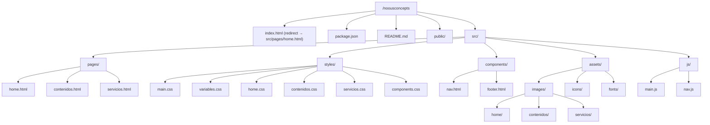
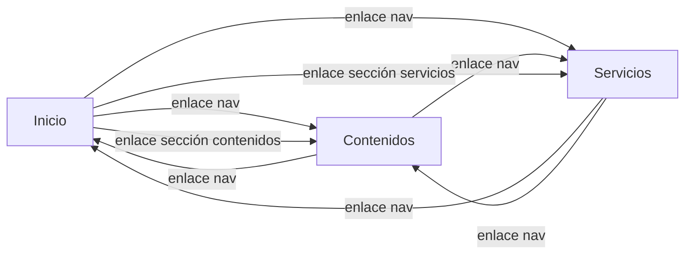
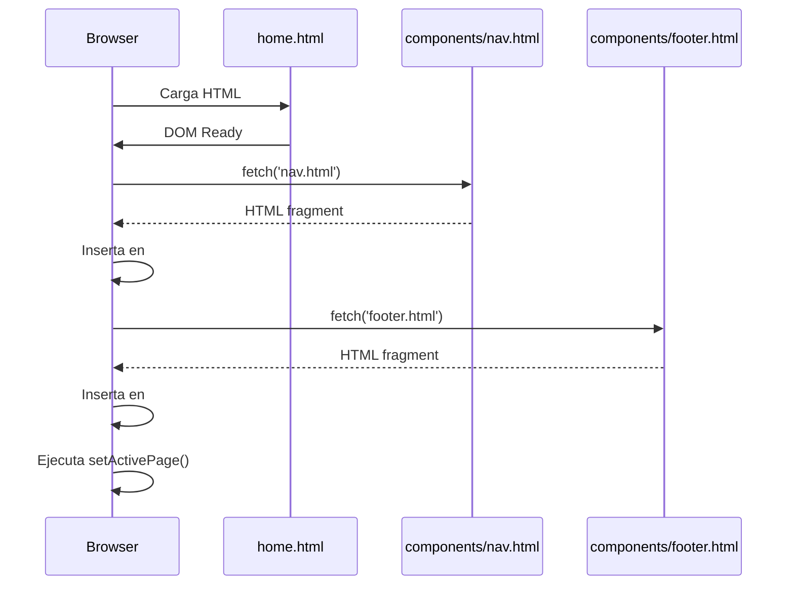

# Design Document: NOUS CONCEPTS Website

## Overview

Este documento describe el diseño técnico del sitio web de NOUS CONCEPTS, un estudio creativo especializado en cómics, animación y video ubicado en el Caribe colombiano. El sitio reemplazará la página actual de Google Sites con un sitio estático personalizado que presenta la identidad de marca, contenidos originales y servicios del estudio.

### Decisiones Técnicas Clave

- **Sitio estático (HTML/CSS/JS)**: No se requiere framework ni servidor backend. El sitio es informativo y de presentación.
- **Vanilla CSS con variables**: Sistema de diseño basado en CSS custom properties para mantener consistencia visual.
- **JavaScript vanilla**: Interactividad mínima (menú móvil, indicador de página activa) sin necesidad de frameworks.
- **Estructura modular**: Componentes HTML reutilizables (header/footer) incluidos mediante JavaScript para evitar duplicación.

### Alcance

El sitio consta de 3 páginas principales:
1. **Inicio (home.html)** — Landing page con identidad del estudio
2. **Contenidos (contenidos.html)** — Portafolio de proyectos creativos
3. **Servicios (servicios.html)** — Catálogo de servicios ofrecidos

## Architecture

### Diagrama de Estructura del Proyecto



### Flujo de Navegación



### Estrategia de Inclusión de Componentes

Los componentes reutilizables (navegación y pie de página) se cargan mediante JavaScript usando `fetch()` para insertar el HTML de los fragmentos en cada página. Esto evita duplicación de código y permite mantener los componentes en un solo lugar.



## Components and Interfaces

### 1. Componente de Navegación (`nav.html` + `nav.js`)

**Responsabilidad**: Proporcionar navegación principal entre páginas y adaptarse a dispositivos móviles.

**Estructura HTML**:
```html
<nav class="main-nav" role="navigation" aria-label="Navegación principal">
  <div class="nav-brand">
    <a href="home.html">NOUS CONCEPTS</a>
  </div>
  <button class="nav-toggle" aria-expanded="false" aria-controls="nav-menu" aria-label="Abrir menú">
    <span class="nav-toggle-icon"></span>
  </button>
  <ul id="nav-menu" class="nav-links" role="menubar">
    <li role="none"><a href="home.html" role="menuitem" data-page="home">Inicio</a></li>
    <li role="none"><a href="contenidos.html" role="menuitem" data-page="contenidos">Contenidos Originales</a></li>
    <li role="none"><a href="servicios.html" role="menuitem" data-page="servicios">Servicios</a></li>
  </ul>
</nav>
```

**Interfaz JavaScript (`nav.js`)**:
```javascript
// Funciones exportadas
function initNavigation()          // Inicializa eventos del menú y página activa
function toggleMobileMenu()        // Alterna visibilidad del menú en móvil
function setActivePage(pageName)   // Marca la página activa en la navegación
function getPageNameFromPath(path) // Extrae nombre de página del path actual
```

**Comportamiento**:
- En viewport ≤ 768px, el menú se colapsa y se muestra un botón hamburguesa.
- `aria-expanded` se actualiza al abrir/cerrar el menú.
- La página activa se determina automáticamente desde la URL.
- El enlace activo recibe la clase `nav-link--active`.

### 2. Componente de Pie de Página (`footer.html`)

**Responsabilidad**: Mostrar información de contacto y enlaces a redes sociales.

**Estructura HTML**:
```html
<footer class="site-footer" role="contentinfo">
  <div class="footer-social">
    <a href="https://instagram.com/nousconcepts" target="_blank" rel="noopener noreferrer" aria-label="Instagram">
      
    </a>
    <a href="https://youtube.com/@nousconcepts" target="_blank" rel="noopener noreferrer" aria-label="YouTube">
      
    </a>
    <a href="https://facebook.com/nousconcepts" target="_blank" rel="noopener noreferrer" aria-label="Facebook">
      
    </a>
  </div>
  <div class="footer-contact">
    <a href="mailto:contacto@nousconcepts.com">contacto@nousconcepts.com</a>
  </div>
  <p class="footer-copy">&copy; 2024 NOUS CONCEPTS. Todos los derechos reservados.</p>
</footer>
```

### 3. Componente de Tarjeta de Proyecto

**Responsabilidad**: Presentar cada proyecto del portafolio con información consistente.

**Estructura HTML**:
```html
<article class="project-card" data-category="educativos|entretenimiento">
  <div class="project-card__content">
    <h3 class="project-card__title">{título}</h3>
    <p class="project-card__description">{descripción}</p>
    <!-- Opcional: enlace externo -->
    <a href="{url}" target="_blank" rel="noopener noreferrer" class="project-card__link">
      Ver proyecto →
    </a>
  </div>
</article>
```

### 4. Cargador de Componentes (`main.js`)

**Responsabilidad**: Incluir componentes reutilizables en cada página mediante fetch.

**Interfaz**:
```javascript
async function loadComponent(selector, componentPath) // Carga un fragmento HTML en el selector dado
function initPage()                                    // Orquesta la carga de componentes e inicialización
```

**Manejo de errores**: Si un componente no carga, el placeholder permanece vacío pero no afecta el resto de la página.

## Data Models

### Modelo de Proyecto (contenidos)

```javascript
/**
 * Representa un proyecto creativo del portafolio.
 * @typedef {Object} Proyecto
 * @property {string} id - Identificador único (kebab-case del título)
 * @property {string} titulo - Nombre del proyecto
 * @property {string} descripcion - Descripción del proyecto
 * @property {('educativos'|'entretenimiento')} categoria - Categoría del proyecto
 * @property {string|null} enlaceExterno - URL al recurso externo (opcional)
 */

const proyectos = [
  {
    id: "el-combo",
    titulo: "El Combo",
    descripcion: "Serie animada educativa",
    categoria: "educativos",
    enlaceExterno: null
  },
  {
    id: "neo-samaria-conexion",
    titulo: "Neo Samaria Conexión",
    descripcion: "Proyecto de ciencia ficción",
    categoria: "entretenimiento",
    enlaceExterno: null
  },
  {
    id: "colombia-mix",
    titulo: "Colombia Mix",
    descripcion: "Comedia social",
    categoria: "entretenimiento",
    enlaceExterno: null
  },
  {
    id: "panico-disforico",
    titulo: "Pánico Disfórico",
    descripcion: "Serie de cómic transmedia de horror y paranormal",
    categoria: "entretenimiento",
    enlaceExterno: null
  }
];
```

### Modelo de Servicio

```javascript
/**
 * Representa un servicio ofrecido por el estudio.
 * @typedef {Object} Servicio
 * @property {string} nombre - Nombre del servicio
 * @property {string} descripcion - Descripción breve (máx 150 caracteres)
 * @property {('creacion-narracion-grafica'|'animacion')} categoria - Categoría del servicio
 */

const servicios = {
  "creacion-narracion-grafica": [
    { nombre: "Story Board", descripcion: "..." },
    { nombre: "Cómic", descripcion: "..." },
    { nombre: "Ilustración Editorial", descripcion: "..." },
    { nombre: "Concept Art", descripcion: "..." }
  ],
  "animacion": [
    { nombre: "Educativos", descripcion: "..." },
    { nombre: "Publicitarios", descripcion: "..." },
    { nombre: "Institucionales", descripcion: "..." },
    { nombre: "Entretenimiento", descripcion: "..." }
  ]
};
```

### Modelo de Navegación

```javascript
/**
 * Configuración de páginas del sitio para navegación.
 * @typedef {Object} PageConfig
 * @property {string} name - Identificador de la página
 * @property {string} label - Texto visible en la navegación
 * @property {string} path - Ruta relativa al archivo HTML
 */

const pages = [
  { name: "home", label: "Inicio", path: "home.html" },
  { name: "contenidos", label: "Contenidos Originales", path: "contenidos.html" },
  { name: "servicios", label: "Servicios", path: "servicios.html" }
];
```

### Variables CSS (Design Tokens)

```css
:root {
  /* Colores — se definirán según la identidad de marca del estudio */
  --color-primary: #1a1a2e;
  --color-secondary: #16213e;
  --color-accent: #e94560;
  --color-text: #eaeaea;
  --color-text-muted: #a0a0a0;
  --color-bg: #0f0f1a;
  --color-surface: #1a1a2e;
  
  /* Tipografía */
  --font-heading: 'CustomHeading', sans-serif;
  --font-body: 'CustomBody', sans-serif;
  --font-size-base: 1rem;
  --font-size-lg: 1.25rem;
  --font-size-xl: 2rem;
  --font-size-hero: 3.5rem;
  
  /* Espaciado */
  --spacing-xs: 0.5rem;
  --spacing-sm: 1rem;
  --spacing-md: 2rem;
  --spacing-lg: 4rem;
  --spacing-xl: 6rem;
  
  /* Breakpoints (usados en media queries) */
  --breakpoint-mobile: 768px;
  
  /* Navegación */
  --nav-height: 64px;
}
```


## Correctness Properties

*A property is a characteristic or behavior that should hold true across all valid executions of a system — essentially, a formal statement about what the system should do. Properties serve as the bridge between human-readable specifications and machine-verifiable correctness guarantees.*

### Property 1: Project card rendering completeness

*For any* valid project object (with non-empty title, non-empty description, and a valid category), the rendered HTML output of the project card component should contain the project's title text, description text, and category identifier.

**Validates: Requirements 3.3**

### Property 2: External link conditional rendering

*For any* project object, if the project has a non-null external link URL, the rendered HTML should include an anchor element with `target="_blank"` and `href` equal to that URL. If the external link is null, no external link element should appear in the rendered output.

**Validates: Requirements 3.8**

### Property 3: Service description constraint and rendering

*For any* valid service object (with non-empty name and description), the description should be at most 150 characters, and the rendered HTML output should contain both the service name and description text.

**Validates: Requirements 4.2, 4.3**

### Property 4: Active page identification from path

*For any* valid page path from the set of site pages, the `getPageNameFromPath` function should return the correct page identifier, and applying `setActivePage` with that identifier should result in exactly one navigation link receiving the active class, corresponding to the correct page.

**Validates: Requirements 5.5**

## Error Handling

### Carga de Componentes

| Escenario | Comportamiento |
|-----------|---------------|
| Falla al cargar `nav.html` | El placeholder `#nav-placeholder` permanece vacío. La página sigue siendo funcional sin navegación compartida. Se registra error en consola. |
| Falla al cargar `footer.html` | El placeholder `#footer-placeholder` permanece vacío. El contenido principal no se afecta. Se registra error en consola. |
| JavaScript deshabilitado | Los placeholders permanecen vacíos. El contenido estático de cada página se muestra correctamente. Los enlaces directos en el contenido siguen funcionando. |

### Renderizado de Proyectos

| Escenario | Comportamiento |
|-----------|---------------|
| Un proyecto tiene campos faltantes | Se omite el campo faltante pero se renderiza el resto del proyecto. No se rompe la estructura de la página. |
| Enlace externo inválido (URL malformada) | Se renderiza el enlace tal cual. El navegador manejará el error al hacer clic. |
| Categoría no reconocida | El proyecto no se asigna a ninguna sección. Se registra advertencia en consola. |

### Navegación Responsiva

| Escenario | Comportamiento |
|-----------|---------------|
| Error al detectar página activa | Ningún enlace recibe la clase activa. La navegación sigue funcional. |
| Menú móvil no responde al clic | Se implementa CSS fallback con `:target` como alternativa al JS toggle. |

### Recursos Estáticos

| Escenario | Comportamiento |
|-----------|---------------|
| Imagen no carga | Se muestra el atributo `alt` descriptivo. El layout se mantiene con dimensiones reservadas vía CSS (`aspect-ratio` o dimensiones explícitas). |
| Fuente personalizada no carga | Se aplica la fuente fallback del sistema definida en el `font-family` stack. |
| Ícono SVG no carga | Se muestra el texto alternativo del `aria-label`. |

## Testing Strategy

### Enfoque General

Este proyecto utiliza un enfoque de testing dual:

1. **Tests de ejemplo (unit tests)**: Verifican escenarios específicos, estructura HTML y contenido estático.
2. **Tests de propiedad (property-based tests)**: Verifican propiedades universales de las funciones de renderizado y lógica de navegación.

### Herramientas

- **Test runner**: Vitest (compatible con el ecosistema sin framework pesado)
- **Property-based testing**: fast-check (integrado con Vitest)
- **DOM testing**: jsdom (entorno de browser simulado para tests)

### Tests de Propiedad (PBT)

Cada property test ejecutará un mínimo de **100 iteraciones** con datos generados aleatoriamente.

| Property | Descripción | Generador |
|----------|-------------|-----------|
| Property 1 | Project card rendering completeness | Objetos Proyecto con título, descripción y categoría aleatorios |
| Property 2 | External link conditional rendering | Objetos Proyecto con enlaceExterno aleatorio (null o URL válida) |
| Property 3 | Service description constraint | Objetos Servicio con nombre y descripción aleatorios (≤150 chars) |
| Property 4 | Active page identification | Paths de páginas válidos generados a partir del conjunto de páginas del sitio |

Cada test será etiquetado con:
```
// Feature: nous-concepts-website, Property {N}: {descripción}
```

### Tests de Ejemplo (Unit Tests)

| Área | Tests |
|------|-------|
| Estructura de carpetas | Verificar existencia de todos los archivos y directorios requeridos |
| Página de Inicio | Verificar presencia de secciones en orden correcto, tagline, CTA, enlaces |
| Página de Contenidos | Verificar proyectos específicos en sus categorías correctas |
| Página de Servicios | Verificar categorías de servicios y sección de contacto |
| Navegación | Verificar enlaces presentes, responsive behavior a 768px |
| Accesibilidad | Verificar atributos ARIA, roles, alt texts |
| Enlaces externos | Verificar `target="_blank"` y `rel="noopener noreferrer"` en redes sociales |

### Tests de Integración

| Escenario | Descripción |
|-----------|-------------|
| Carga de componentes | Verificar que nav.html y footer.html se insertan correctamente en cada página |
| Navegación entre páginas | Verificar que los enlaces internos apuntan a archivos existentes |
| Fallback ante error | Verificar que la página se mantiene funcional si falla la carga de un componente |

### Configuración

```json
{
  "scripts": {
    "test": "vitest --run",
    "test:watch": "vitest"
  },
  "devDependencies": {
    "vitest": "^1.0.0",
    "fast-check": "^3.0.0",
    "jsdom": "^24.0.0"
  }
}
```
