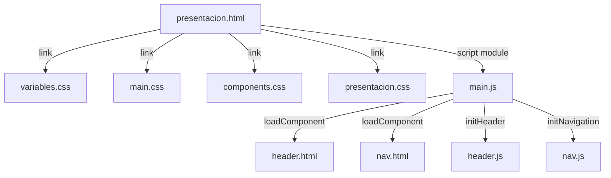

# Design Document: Pantalla Presentación (Modo Oscuro)

## Overview

La Pantalla_Presentación es una nueva página del sitio web Nous Concepts que presenta información introductoria del estudio en un diseño minimalista centrado en la lectura. Sigue la arquitectura existente del proyecto: HTML estático, CSS con variables (design tokens), y carga dinámica de componentes reutilizables (Header, Nav) mediante el patrón `loadComponent`.

La pantalla aplica modo oscuro como tema predeterminado utilizando los tokens de diseño ya definidos en `src/styles/variables.css`, garantizando coherencia visual con las demás páginas del sitio (home, servicios, contenidos).

### Decisiones de diseño clave

1. **Reutilización del Header existente**: Se carga `src/components/header.html` vía `loadComponent`, idéntico a las demás páginas.
2. **CSS dedicado**: Se crea un archivo `src/styles/presentacion.css` para los estilos específicos de la página, siguiendo el patrón de `home.css`, `servicios.css`, `contenidos.css`.
3. **Mobile-first**: Los estilos base se definen para viewport ≤ 768px; las mejoras para pantallas mayores se aplican con `@media (min-width: 769px)`.
4. **Sin JavaScript adicional**: La página no requiere lógica propia más allá de la inicialización estándar (`loadComponent` + `initHeader` + `initNavigation`).

## Architecture



### Estructura de archivos (nuevos)

```
src/
├── pages/
│   └── presentacion.html    ← Nueva página HTML
└── styles/
    └── presentacion.css     ← Estilos específicos de la página
```

### Flujo de carga

1. El navegador carga `presentacion.html`
2. Se aplican los estilos (variables.css → main.css → components.css → presentacion.css)
3. `main.js` se ejecuta en `DOMContentLoaded`
4. `loadComponent` inyecta el Header y Nav en sus placeholders
5. `initHeader()` y `initNavigation()` inicializan la interactividad

## Components and Interfaces

### presentacion.html

Estructura HTML semántica de la página:

```html
<!DOCTYPE html>
<html lang="es">
<head>
  <meta charset="UTF-8" />
  <meta name="viewport" content="width=device-width, initial-scale=1.0" />
  <title>Presentación — NOUS CONCEPTS</title>
  <link rel="stylesheet" href="../styles/variables.css" />
  <link rel="stylesheet" href="../styles/main.css" />
  <link rel="stylesheet" href="../styles/components.css" />
  <link rel="stylesheet" href="../styles/presentacion.css" />
</head>
<body>
  <div id="header-placeholder"></div>
  <div id="nav-placeholder"></div>

  <main class="presentacion" aria-label="Presentación del estudio Nous Concepts">
    <h1 class="presentacion__title">Presentación</h1>

    <section class="presentacion__content" aria-label="Contenido de la presentación">
      <p><!-- Párrafo(s) de contenido --></p>
    </section>
  </main>

  <script type="module" src="../js/main.js"></script>
</body>
</html>
```

### Componentes reutilizados

| Componente | Archivo | Carga |
|---|---|---|
| Header | `src/components/header.html` | `loadComponent('#header-placeholder', '../components/header.html')` |
| Nav | `src/components/nav.html` | `loadComponent('#nav-placeholder', '../components/nav.html')` |

### Interfaz CSS (presentacion.css)

Clases BEM para la página:

| Selector | Responsabilidad |
|---|---|
| `.presentacion` | Contenedor principal (`<main>`), padding y min-height |
| `.presentacion__title` | Título h1, alineación derecha, tipografía responsiva |
| `.presentacion__content` | Sección de párrafos, max-width, centrado, line-height |
| `.presentacion__content p` | Estilos de párrafo individual |

## Data Models

Esta pantalla no maneja estado de aplicación ni modelos de datos. Todo el contenido es estático (HTML) y los tokens de diseño se definen en CSS custom properties.

### Design Tokens utilizados

| Variable | Valor | Uso |
|---|---|---|
| `--color-bg` | `#0f0f1a` | Fondo del body y sección de contenido |
| `--color-text` | `#eaeaea` | Color de texto (título y párrafos) |
| `--color-primary` | `#1a1a2e` | Fondo del Header |
| `--font-heading` | `'CustomHeading', sans-serif` | Tipografía del título |
| `--font-body` | `'CustomBody', sans-serif` | Tipografía de párrafos |
| `--font-size-base` | `1rem` | Texto mobile |
| `--font-size-lg` | `1.25rem` | Texto desktop |
| `--font-size-xl` | `2rem` | Título mobile |
| `--font-size-hero` | `3.5rem` | Título desktop |
| `--spacing-sm` | `1rem` | Padding horizontal |
| `--nav-height` | `64px` | Altura del Header fijo |
| `--breakpoint-mobile` | `768px` | Umbral responsivo |

## Correctness Properties

Esta sección no aplica para esta feature. La Pantalla_Presentación es una página estática de UI rendering y layout (HTML + CSS) sin funciones puras, transformaciones de datos ni lógica algorítmica que varíe con la entrada. No es posible formular propiedades universalmente cuantificadas ("para todo input X, se cumple P(X)") porque no existe un input space variable.

La verificación de correctitud se realiza mediante tests example-based que validan estructura DOM, propiedades CSS computadas y atributos de accesibilidad (ver Testing Strategy).

## Error Handling

Esta pantalla es contenido estático con mínima lógica. Los escenarios de error son:

| Escenario | Manejo | Responsable |
|---|---|---|
| Fallo en `loadComponent` (header/nav no carga) | `console.error` + la página muestra contenido sin header | `main.js` (existente) |
| CSS no carga | Navegador muestra contenido sin estilos (degradación elegante) | Navegador |
| JavaScript deshabilitado | Contenido visible (HTML semántico), sin interactividad de menú | Diseño progresivo |
| Fuentes personalizadas no cargan | Fallback a `sans-serif` definido en font stack | CSS |

No se requiere manejo de errores adicional ya que no hay operaciones asíncronas propias ni interacción de datos.

## Testing Strategy

### Justificación: PBT no aplicable

Esta funcionalidad es primordialmente **UI rendering y layout** — una página HTML estática con estilos CSS. No contiene funciones puras con comportamiento variable según entrada, ni transformaciones de datos, ni lógica algorítmica. Por lo tanto, **property-based testing no es apropiado** para esta feature.

Las razones específicas:
- El contenido es estático (no hay input space variable)
- Los estilos son declarativos (CSS), no funciones ejecutables
- La interactividad (Header/Nav) ya está testeada en las specs existentes
- Los criterios de aceptación son verificaciones puntuales de estructura DOM y propiedades CSS computadas

### Estrategia de testing

#### 1. Tests unitarios (Vitest + jsdom)

Tests example-based que verifican la estructura HTML y los atributos de accesibilidad:

| Test | Verifica |
|---|---|
| Estructura de la página | Orden correcto: header-placeholder → nav-placeholder → main → h1 → section |
| Único h1 | Solo un elemento `<h1>` en el documento |
| Semántica de contenido | `<main>` o `<section>` con `aria-label` presente |
| Texto del título | h1 contiene "Presentación" |
| Alineación del título | `text-align: right` en `.presentacion__title` |
| Llamadas a loadComponent | `initPage` invoca loadComponent con los selectores y rutas correctos |

#### 2. Tests de CSS / lint (Vitest)

Verificaciones sobre el archivo CSS:

| Test | Verifica |
|---|---|
| Sin colores literales | Ninguna declaración de color usa valores hex/rgb directos (solo variables) |
| Mobile-first | Media queries usan `min-width` (no `max-width`) |
| Breakpoint único | Solo se usa 768px/769px como breakpoint |
| Variables requeridas | Se referencian `--color-bg`, `--color-text`, `--font-heading` |

#### 3. Tests de contraste (Vitest)

| Test | Verifica |
|---|---|
| Contraste texto/fondo | Ratio entre `#eaeaea` y `#0f0f1a` ≥ 4.5:1 (WCAG AA) |
| Contraste focus | Indicador de foco ≥ 3:1 respecto al fondo adyacente |

#### 4. Tests de integración (navegador / E2E)

Para validación completa en un entorno de navegador real:

| Test | Verifica |
|---|---|
| Sin scroll horizontal | En viewports de 320px a 1920px no aparece scrollbar horizontal |
| Responsividad tipográfica | Font-size escala correctamente al cruzar 768px |
| Header fijo | Header permanece visible durante scroll |
| Tab order | Elementos interactivos alcanzables en orden visual |
| Carga de componentes | Header y Nav se renderizan correctamente |

### Herramientas

- **Vitest** con jsdom para unit tests (ya configurado en el proyecto)
- **Tests manuales** con DevTools para verificación visual y de responsive
- No se requiere Playwright/Cypress ya que la funcionalidad del Header/Nav ya tiene cobertura en specs existentes

### Archivo de test

```
src/js/presentacion.test.js  ← Tests unitarios de estructura y CSS
```
